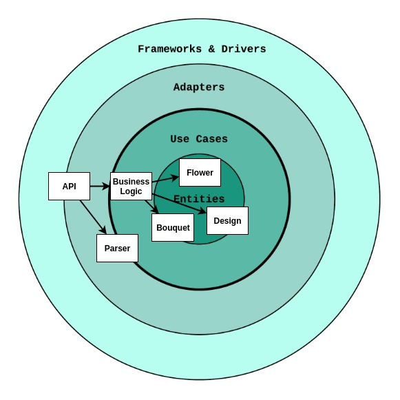

# bloomon

### About the project
Python challenge.  
I tried with principles from Robert Martin's Clean architecture.

### Run the program in Docker
``` bash
docker build -t bloomon .
# -i stands for interactive mode and -t will allocate a pseudo terminal for us
docker run -i -t bloomon
```

### Class diagram
\

